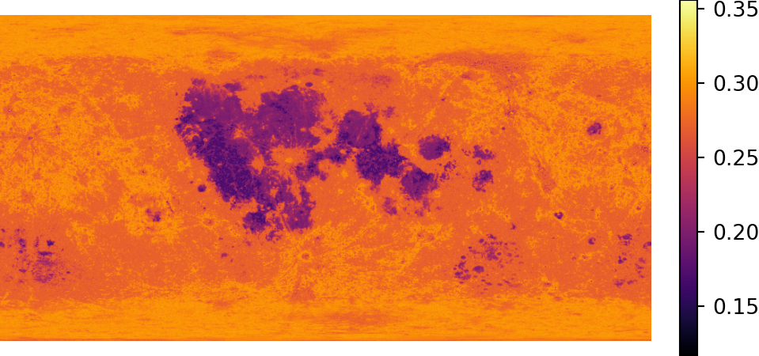
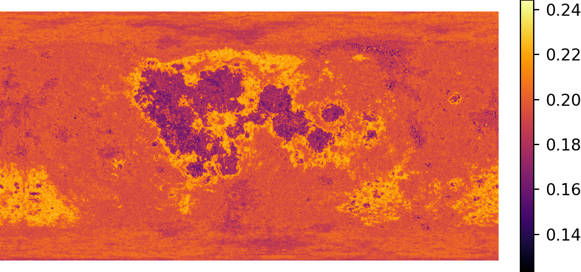
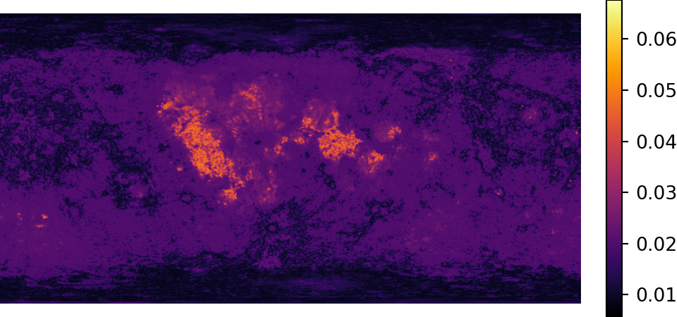
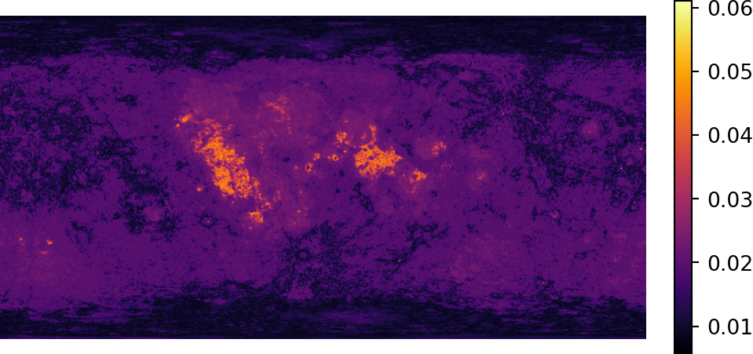
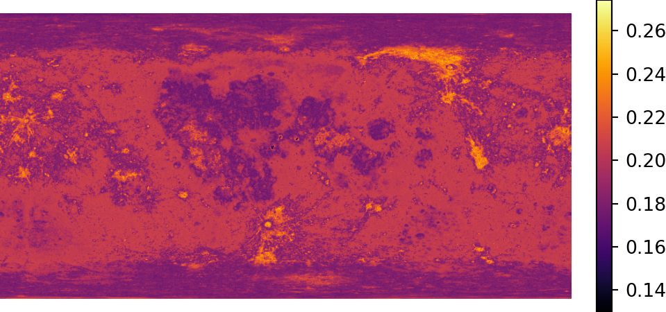
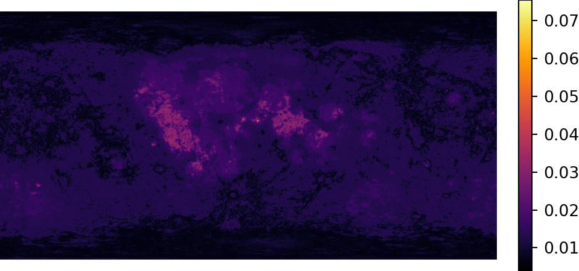
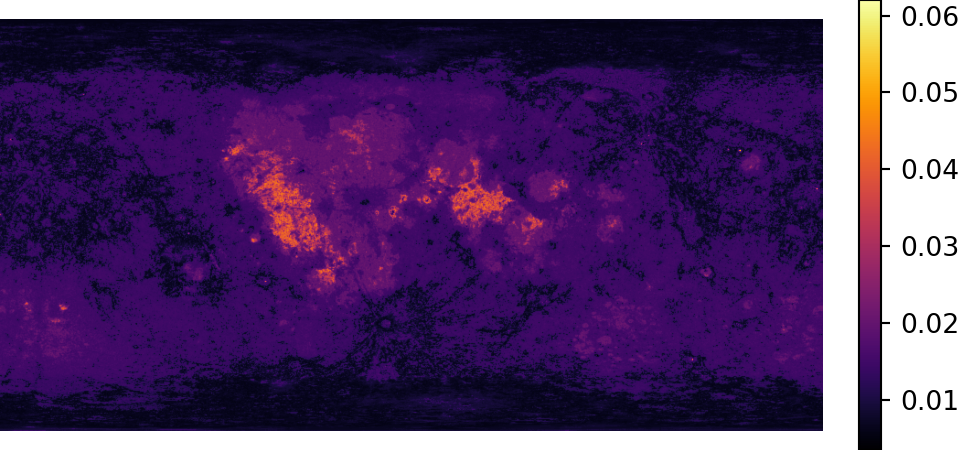

# ISRO : High-Resolution Elemental Mapping of Lunar Surface

<!-- TABLE OF CONTENTS -->
## Table of Contents

- [ISRO : High-Resolution Elemental Mapping of Lunar Surface](#isro--high-resolution-elemental-mapping-of-lunar-surface)
  - [Table of Contents](#table-of-contents)
  - [About the project](#about-the-project)
  - [Project Structure (change after complete cleaning)](#project-structure-change-after-complete-cleaning)
  - [Installation](#installation)
  - [Run](#run)
  - [Explanation](#explanation)
  - [Results](#results)

<!-- TOC --><a name="about-the-project"></a>
## About the project

This project uses data from Chandrayaan-2’s CLASS instrument to make detailed maps of the Moon’s surface. These maps show the different elements present on the Moon. By studying the intensity of X-ray fluorescence (XRF) lines emitted by elements like magnesium, Silicon, and Aluminum, induced by solar flares, and calculating ratios such as Mg/Si and Al/Si, the project derives spatially resolved compositional information while mitigating the influence of varying solar flare conditions. A strong data processing pipeline extracts, models, and validates elemental abundances from spectral data, facilitating the creation of compositional maps with a spatial resolution of approximately 12 km. These maps, overlaid on lunar albedo data, illuminate compositional variations, providing valuable insights into mineral distribution and potential in-situ resource locations. This research contributes to lunar exploration efforts by deepening our geological understanding and aiding in future mission planning.

<!-- TOC --><a name="project-structure"></a>
## Project Structure (change after complete cleaning)
```
.
├── README.md
├── main.py
└── scripts
    ├── abundance
    │   ├── X2ABUND_FIT
    │   │   ├── background.py
    │   │   ├── common_modules.py
    │   │   ├── data_constants
    │   │   ├── fit_larch.py
    │   │   ├── fit_optuna.py
    │   │   ├── get_constants_xrf_new_V2.py
    │   │   ├── get_xrf_lines_V1.py
    │   │   ├── get_xrf_lines_V2.py
    │   │   ├── mergeFits.py
    │   │   ├── parallel.py
    │   │   ├── responsefiles.py
    │   │   ├── scripts
    │   │   │   ├── plot_fits.py
    │   │   │   └── test_fits.py
    │   │   ├── single_fit_optuna.py
    │   │   ├── tempCodeRunnerFile.py
    │   │   ├── tes.py
    │   │   ├── test
    │   │   │   ├── plots_x2abund_test.pdf
    │   │   │   ├── test_fits.py
    │   │   │   ├── test_x2abund.py
    │   │   │   └── xcm_x2abund_test.xcm
    │   │   ├── test.py
    │   │   ├── tif.py
    │   │   ├── xrf_comp_new_V2.py
    │   │   └── xrf_comp_new_V3.py
    │   ├── earthmover
    │   │   ├── earthmover.py
    │   │   └── utils.py
    │   ├── pipeline
    │   │   ├── BKG
    │   │   ├── abundances_results_final.csv
    │   │   ├── common_modules.py
    │   │   ├── data_constants
    │   │   │   ├── ffast
    │   │   │   ├── form_factors
    │   │   │   └── xcom
    │   │   ├── define_xrf_localmodel.py
    │   │   ├── fits_utils.py
    │   │   ├── get_constants_xrf_new_V2.py
    │   │   ├── get_xrf_lines_V1.py
    │   │   ├── get_xrf_lines_V2.py
    │   │   ├── gpufit.py
    │   │   ├── jax_fit.py
    │   │   ├── mergeFits.py
    │   │   ├── merged_data.parquet
    │   │   ├── parallel.py
    │   │   ├── parallelSpec.py
    ├── ball_tree
    │   ├── ball_tree.pkl
    │   └── clustering.py
    ├── fits_utils
    │   ├── addPHAs.py
    │   ├── conv.py
    │   ├── group.py
    │   ├── merge.py
    │   ├── mergesimilar.py
    │   └── phaviz.py
    ├── flare_ops
    │   ├── README.md
    │   ├── flare_catalog
    │   │   ├── classifier.py
    │   │   ├── classifier_loop.py
    │   │   ├── pipeline.py
    │   │   └── pipeline.sh
    │   ├── gen_files.py
    │   ├── getFitsforXSM.py
    │   ├── solar_model.py
    │   ├── solar_model_1.py
    │   ├── solar_test.py
    │   ├── spec_arf
    │   ├── spec_pha
    │   └── spectrum
    ├── fp_solver
    │   ├── __init__.py
    │   ├── claisse_quintin.py
    │   ├── fit.py
    │   ├── intensity_finder.py
    │   ├── main.ipynb
    │   └── preprocessing.py
    ├── image-augmentation
    │   └── Image Augmentation.py
    ├── jaxspec
    │   ├── common_modules.py
    │   ├── customModels.py
    │   ├── data_constants
    │   │   ├── ffast
    │   │   ├── form_factors
    │   │   └── xcom
    │   ├── define_xrf_localmodel.py
    │   ├── get_constants_xrf_new_V2.py
    │   ├── get_xrf_lines_V1.py
    │   ├── parallel.py
    │   ├── pyxtojax.py
    │   ├── test
    │   │   ├── test_fits.py
    │   │   ├── test_x2abund.py
    │   │   └── xcm_x2abund_test.xcm
    │   ├── test3.py
    │   └── xrf_comp_new_V3.py
    ├── map_making
    │   └── gaussian_avg.py
    ├── mineral_groups
    │   └── mineral.py
    ├── monte_carlo
    │   ├── ele_abund_lpgrs.py
    │   ├── images
    │   ├── lpgrs_elemental_maps
    │   │   ├── Al_image.jpeg
    │   │   └── O_grey_scale.jpeg
    │   ├── subprocess_cli.py
    │   ├── sumcounts.py
    │   └── txt_xsmi.py
    ├── solar
    │   ├── merged_data.parquet
    │   ├── solar.pkl
    │   └── solar_process.ipynb
    ├── super-resolution
    │   ├── UNet generalized Flexible.ipynb
    │   ├── Unet
    │   │   ├── dataset.py
    │   │   ├── train.py
    │   │   └── unet-inference.ipynb
    │   ├── elemantal-map-enhancement.ipynb
    │   └── outputs
    ├── utils
    │   ├── IIRS_find_overlaps.py
    │   ├── catalog.py
    │   ├── get-pip.py
    │   ├── high_confidence_ca_al.csv
    │   ├── improve_overlap.py
    │   ├── knee_point.py
    │   ├── lunar_map.py
    │   ├── overlap.py
    │   ├── ratio_to_mineral.py
    │   └── util_utc2met.py
    ├── validation
    │   ├── Elevation_Mapping
    │   │   ├── Elevation_Mapping.py
    │   │   └── Elevation_Mapping_TIFF.py
    │   ├── LPGRS
    │   │   ├── add_header.py
    │   │   ├── images
    │   │   ├── search_for_lat_lon.py
    │   │   └── tab_to_csv.py
    │   ├── TIF
    │   │   ├── TIF_DATA
    │   │   └── tiff.py
    │   └── iirs
    │       ├── extract_lat_lon.py
    │       └── plot_iirs.py
    ├── xrf_fit
    │   ├── GAfit.py
    │   ├── GAfit_plain.py
    │   ├── data_handler.py
    │   ├── data_handler_nobkg.py
    │   ├── element_handler_sub.py
    │   ├── element_model_sub.py
    │   ├── gauss.py
    │   ├── high_confidence_ca_al.csv
    │   ├── optimizer.py
    │   ├── phy.py
    │   ├── phyfit_sub.py
    │   ├── scipy_fit.py
    │   ├── scipy_fit_nobkg copy.py
    │   ├── scipy_fit_nobkg.py
    │   └── spectral_optimizer.py
    └── xsm
        ├── extract_spectra
        │   └── solar_test.py
        ├── xsm_plots
        └── xsm_scripts
            ├── classifyFlarewise.py
            └── findNearest.py

```

<!-- TOC --><a name="installation"></a>
## Installation
Before running the script, ensure all required dependencies are installed. Use the following command to install them:
```bash
pip install -r requirements.txt
```

<!-- TOC --><a name="run"></a>
## Run

The `main.py` script is a command-line tool for performing X-ray Fluorescence (XRF) analysis. It processes two essential inputs: a sample spectrum file (`--sample_file`) and a background spectrum file (`--background_file`), both in FITS or PHA format. The script calculates element intensities, their uncertainties, concentrations, and concentration uncertainties based on the provided data.

Users can enhance the analysis with optional arguments:

`--plot`: Generates visual plots of the intensities and concentrations.   
`--output <file_path>`: Saves the analysis results to a specified file.  

Usage:  Run the script with the following command:

```bash
python main.py --sample_file <path_to_sample_fits> --background_file <path_to_background_fits> [--plot] [--output <file_path>]
```

The results are displayed in a formatted table in the console, and if specified, written to a file. Ensure the input files exist and provide valid data for successful execution.

<!-- TOC --><a name="explanation"></a>
## Explanation

**Overview of Project Modules in ./scripts**  

**abundance/**  
Contains a pipeline for calculating mineral abundance, featuring Earth Mover's Distance for distribution analysis and chi-square minimization via X2ABUND_FIT. The pipeline includes robust validation procedures to ensure precise results.

**ball_tree/**  
Implements advanced clustering techniques using ball tree structures, optimized for high-dimensional spectral data. Includes automated classification and efficient model storage for streamlined data management.

**fits_utils/**  
Provides tools for managing and analyzing FITS files, supporting PHA data integration, spectral file consolidation, and organization based on observational parameters. Includes advanced visualization features for better insights.

**flare_ops/**  
Automates solar flare analysis with algorithms for detecting events, calculating peak flux, duration, and energy, and classifying results. Features integrated logging for seamless tracking.

**fp_solver/**  
Offers a mathematical framework for iterative fixed-point methods in spectral deconvolution, with optimization techniques to address complex convergence issues.

**image-augmentation/**  
Enhances spectral imagery through noise reduction, contrast adjustment, and preprocessing tailored for X-ray images, improving data quality for analysis.

**jaxspec/**  
Leverages JAX acceleration to deliver a high-performance spectral analysis framework. Features parallel processing and GPU-optimized routines for large-scale spectral data.

**map_making/**  
Generates high-resolution elemental and mineral distribution maps from spectral data. Incorporates interpolation and coordinate mapping for creating publication-ready visuals.

**mineral_groups/**  
Specializes in mineral classification using spectral analysis. Integrates a comprehensive mineral library and advanced comparison protocols for reliable identification.

**monte_carlo/**   
Offers a subprocess_cli.py script that processes as
```bash
python subprocess_cli.py <path_to_csv> <path_to_excitatation.txt>
```
It generates xmsi files using the specified continuous excitation energies and weight ratios from the CSV, then executes Monte Carlo simulations to produce the corresponding xmso output files.

**solar/**   
Processes solar X-ray data with algorithms for flare detection, background radiation analysis, and temporal spectral evolution. Tailored routines support solar observation time-series analysis.

**super-resolution/**  
Applies cutting-edge deep learning models to enhance spectral images. Optimized super-resolution algorithms are designed for X-ray and spectral data applications.

**utils/**  
Offers key analytical tools such as knee point detection, peak identification, and spectral smoothing. Includes versatile file handling and mathematical operations for diverse datasets.

**validation/**  
Ensures quality through rigorous validation processes, benchmarking, and result verification. Assesses the accuracy of abundance calculations and spectral fitting.

**xrf_fit/**  
Focuses on X-ray fluorescence analysis, incorporating peak deconvolution, background correction, and elemental identification. Features advanced calibration for quantitative assessments.

**xsm/**  
Processes X-ray spectrometer data with calibration, background correction, and response matrix calculations. Includes instrument-specific adjustments and standardized data formatting.

<!-- TOC --><a name="results"></a>
## Results

- Al/Si Map


- Ca/Si Map


- Cr/Si Map


- Fe/Si Map


- Mg/Si Map


- Mn/Si Map


- Ti/Si Map

